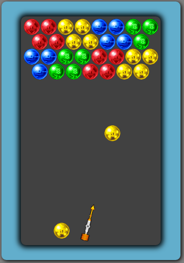

## BubblePop

[Live](http://www.peterzhen.com/BubblePop)

BubblePop is inspired by the 1994 arcade game Puzzle Bobble.  It's written in JavaScript and it leverages the EaselJS library with Canvas.

### How to Play

The goal of the game is to pop all the bubbles on the screen.  The bubbles pop when three or more bubbles match up.  Control the shooter by using the `LEFT` and `RIGHT` arrow keys.  To shoot the bubble from the shooter, just hit `SPACE`.  



### Features

The game uses EaselJS to render the sprites on the screen.  Bubbles are stored using a custom grid system to efficiently search for matching bubbles.  All shooting bubbles are checked for collisions before snapping on to the grid.

```javascript
checkCollision(bubble1, bubble2) {
  const dx = bubble1.x - bubble2.x;
  const dy = bubble1.y - bubble2.y;
  const distance = Math.sqrt(dx * dx + dy * dy);

  if (distance < bubbleWidth) return true;

  return false;
}
```
