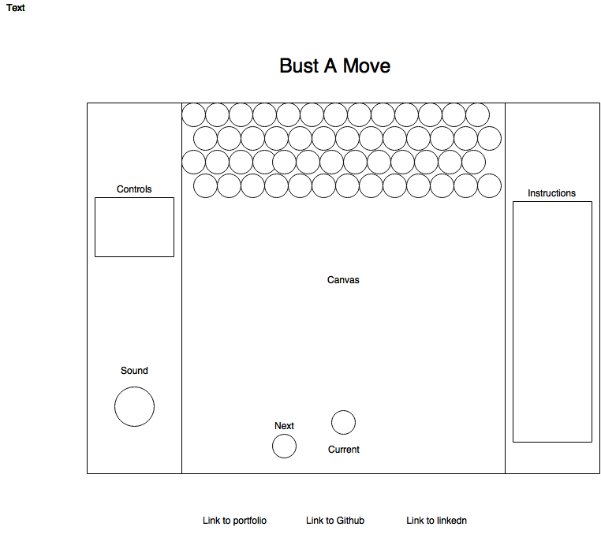

## JS Project Proposal: Bust-A-Move

### Background

Bust-A-Move is an arcade puzzle game built by Taito Coporation in 1994.  The goal of the game is to clear the board of bubbles.  Colored bubbles are stored in a grid on the top of the canvas in a 2D array.  A stage is present on the bottom with a randomized colored bubble that you can shoot towards the top grid of bubbles.  Bubbles are cleared when 4 or more bubbles are grouped together.  After a certain amount of turns, an extra row of bubbles will form towards the top to increase difficulty.  This clone of the game will cover the key game logic that the original game has.

### Functionality & MVP  

- [ ] Start, pause game and build game with preset 2D grid.
- [ ] Snap bubbles to grid.
- [ ] Use key listeners to aim stage and shoot.
- [ ] Find clusters and detect floating bubbles.
- [ ] Add bubbles with a turn counter.

In addition, this project will include:

- [ ] An About modal describing the background and rules of the game
- [ ] A production README

### Wireframes

The game will consist of a rectangular canvas that hold the game and its sprites.  Below the canvas holds the links to Github, Linkedln and my website.  To the left of the canvas controls will be present.

### Architecture and Technologies

This project will be implemented with the following technologies:

- Vanilla JavaScript and `jQuery` for overall structure and game logic,
- `Easel.js` with `HTML5 Canvas` for DOM manipulation and rendering,
- Webpack to bundle and serve up the various scripts.

In addition to the webpack entry file, there will be three scripts involved in this project:

`board.js`: this script will handle the logic for creating and updating the necessary `Easel.js` elements and rendering them to the DOM based on the collisions and properties of `bubble.js`.  This will check for game over and it will be building the 2d grid.

`bubble.js`: this script will handle the collision, size and position of each individual bubble available on the board.

`stage.js`: this script will deal with the aiming and shooting of bubbles.  Key listeners will be bound to keys to aim.

### Implementation Timeline

**Phase 1**: Setup all necessary Node modules, including getting webpack up and running and `Easel.js` installed.  Create `webpack.config.js` as well as `package.json`.  Write a basic entry file and the bare bones of all 3 scripts outlined above.  Learn the basics of `Easel.js`.  Goals for the day:

- Get a green bundle with `webpack`
- Learn enough `Easel.js` to render an object to the `Canvas` element
- Build 2D grid to hold bubbles in `board.js`.

**Phase 2**: Dedicate this day to learning the `Easel.js` API.  Build the `bubble.js` to incorporate into `board.js`.  Start building `stage.js` script.

- Complete `bubble.js `
- Render a 2D grid to the canvas with preset bubbles.
- Create stage script.

**Phase 3**: Build logic to aim and shoot with stage.  Random Bubbles will be generated with the stage and key listeners will be bound to move the shooter.

- Bind key listeners to move shooter within stage.
- Shoot bubbles with key listener.
- Create logic to find clusters after shooting bubble.

**Phase 4**: Detect floating bubbles and add row of extra bubbles with turn count.  Game over Logic will be implemented with `board.js`

- Have a turn counter for the player to add an additional row to the 2D grid.
- Implement game over logic with `board.js`.

### Bonus features

- [ ] Add more levels and introduce `pop`
- [ ] 2-player option
